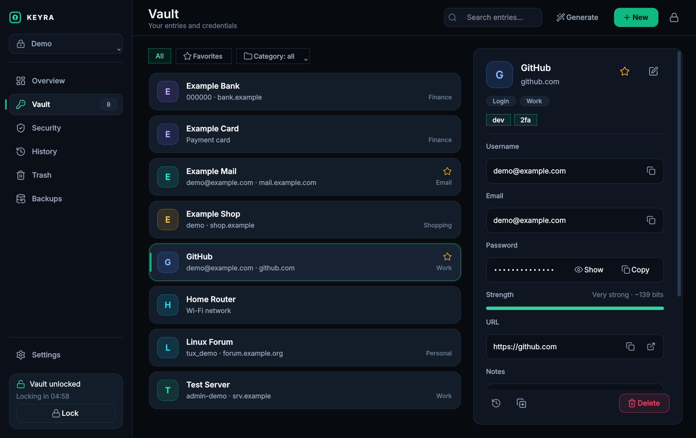
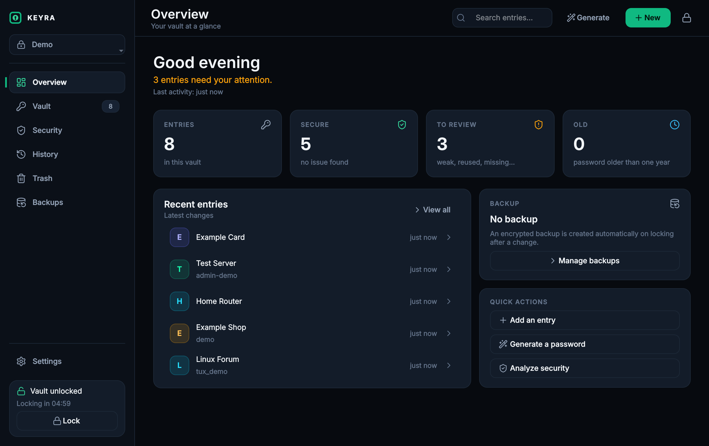
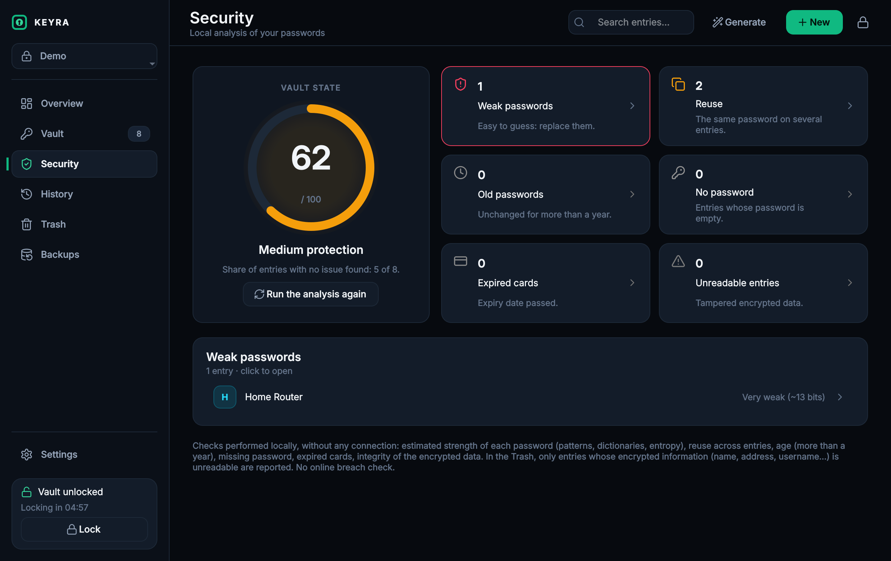
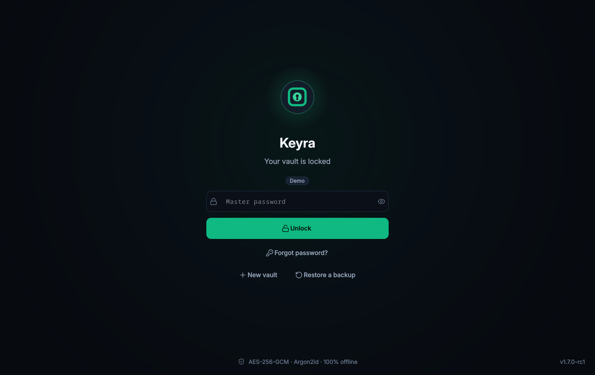

<p align="center">
  <picture>
    <source media="(prefers-color-scheme: dark)" srcset="docs/brand/logo-horizontal-dark.svg">
    
  </picture>
</p>

<p align="center">
  A <strong>local, offline</strong> password manager for Linux desktops.<br>
  PySide6 interface · one SQLite file per vault · Argon2id + AES-256-GCM.<br>
  No online service, no sync, no telemetry.
</p>

<p align="center">
  
</p>

> **Version 1.7.0-rc1 — release candidate, not a final release.**
> Vault format: **schema v4** (encrypted metadata). Vaults created by earlier versions
> (schemas v1 to v3) are upgraded **only after explicit confirmation**
> (see [Upgrading older vaults](#upgrading-older-vaults-v1-to-v3)).
> An upgraded vault can no longer be opened by version 1.6.
>
> The user interface is in **English**. Technical identifiers keep their historical
> names so that existing installations and vaults keep working: Debian package and
> launcher `mon-coffre-fort`, data folders `mon-coffre` and `MonCoffre`, cryptographic
> domains `mon-coffre-fort:…`, file extensions `.mcfbak` and `.mcfexport`.

---

## Contents

* [Screenshots](#screenshots)
* [Features](#features)
* [Installation](#installation)
* [Security model](#security-model)
* [What is encrypted, what stays readable](#what-is-encrypted-what-stays-readable)
* [Storage and schema v4](#storage-and-schema-v4)
* [Categories, favorites, tags and search](#categories-favorites-tags-and-search)
* [History and trash](#history-and-trash)
* [Recovery key](#recovery-key)
* [Backups (.mcfbak)](#backups-mcfbak)
* [Upgrading older vaults (v1 to v3)](#upgrading-older-vaults-v1-to-v3)
* [Import and export](#import-and-export)
* [Everyday security](#everyday-security)
* [Multiple vaults, users, settings](#multiple-vaults-users-settings)
* [Development](#development)
* [Tests](#tests)
* [Project structure](#project-structure)
* [Known limitations](#known-limitations)
* [Roadmap](#roadmap)
* [License](#license)

---

## Screenshots

All data shown is fictitious (demo vault, `example.com` addresses, random passwords).

| Overview | Security audit | Lock screen |
|---|---|---|
|  |  |  |

---

## Features

| Area | What the application does |
|---|---|
| Vaults | Several independent vaults, each with its own master password and data key |
| Entries | 6 types: login, secure note, payment card, identity, Wi-Fi network, server |
| Organization | Built-in and personal categories, favorites, tags (at most 20 per entry) |
| Search | Free text (case- and accent-insensitive) and exact `#tag` |
| History | 20 previous versions per entry, restore a version |
| Trash | Restorable deletion, configurable automatic purge (30 days by default) |
| Access | Master password, optional recovery key, automatic locking |
| Clipboard | Automatic clearing (30 s by default) of copied values |
| Generator | Passwords and passphrases, offline strength estimation |
| Audit | Weak, reused, old (> 1 year) and missing passwords, expired cards, unreadable entries |
| Backups | Encrypted `.mcfbak` files, automatic and manual; restored as a new vault |
| Import / export | Bitwarden, KeePassXC, Chrome, Firefox, CSV; encrypted export, CSV, PDF |
| Upgrade | v1 to v3 vaults → v4, with preflight, confirmation, backup and verification |

---

## Installation

### Debian package

The package is built from source and only declares dependencies provided by Debian 13
(no bundled library). The `1.7.0~rc1` package was validated on Debian 13
(see [Tests](#tests)): build, content inspection, **simulated** installation
(`apt-get -s`, no new dependency) and execution of its code with the system Python and
packages. It was not actually installed during that validation.

Procedure:

```bash
packaging/build-deb.sh                                        # -> dist/mon-coffre-fort_1.7.0~rc1_all.deb
sudo apt install ./dist/mon-coffre-fort_1.7.0~rc1_all.deb     # installs the Debian dependencies
```

* Debian version: `1.7.0-rc1` becomes `1.7.0~rc1`, which guarantees
  `1.6.0 < 1.7.0~rc1 < 1.7.0` for `dpkg`.
* Dependencies: `python3 (>= 3.11)`, `python3-cryptography (>= 43)`,
  `python3-argon2 (>= 21.1)`, `python3-pyside6.*` (QtCore, QtGui, QtWidgets, QtNetwork,
  QtDBus, QtSvg, `>= 6.8`), `python3-pikepdf (>= 9.5)`, `hicolor-icon-theme`.
  Recommended: `wfrench`, `wamerican`, `qt6-wayland`.
* Contents: code in `/usr/lib/mon-coffre-fort`, launcher `/usr/bin/mon-coffre-fort`,
  menu entry and icons. The launcher starts Python in **isolated mode** (`python3 -I`):
  neither `PYTHONPATH` nor a module in the home directory can inject code.
* The package runs no vault migration: any upgrade happens when a vault is opened,
  after confirmation.
* Uninstall: `sudo apt remove mon-coffre-fort`. Vaults, backups and settings are never
  removed by the package (not even with `purge`).
* Installing this package **replaces** a version 1.6 installed the same way. Keep a way
  to reinstall 1.6 if you want to be able to reopen a backup made before the upgrade
  (see [Irreversibility](#irreversibility)).

### From source

See [Development](#development).

---

## Security model

### Keys

```text
master password ──Argon2id (vault salt)──► KEK
KEK ──AES-256-GCM (decryption)──► DEK: random 256-bit data key
DEK ──AES-256-GCM──► secrets of each entry (field by field), history versions
DEK ──HKDF-SHA256──► dedicated subkeys (metadata, categories, backups)
```

* **The master password is never stored.** It is used to derive the KEK, which unwraps
  the DEK. Changing the master password re-wraps the DEK without re-encrypting the data.
* **Argon2id**: 64 MiB of memory, 3 iterations, 4 lanes by default, random 16-byte salt
  per vault. The parameters are stored with the vault and read back within bounds
  (at most 1 GiB, 64 iterations, 64 lanes) so that a crafted file cannot freeze the
  application. Implementation: the one in `cryptography` (version 44 and later),
  otherwise `argon2-cffi` (Debian package `python3-argon2`, the Debian 13 case); the tests
  check that both produce the same key (RFC 9106 vectors).
* **AES-256-GCM** (authenticated encryption): random **96-bit** nonce drawn from
  `secrets` for each encryption. Format of an encrypted blob:
  `version (1 byte) | nonce (12 bytes) | ciphertext + GCM tag (16 bytes)`.
* No home-made cryptographic primitive: only `cryptography`, `argon2-cffi` and the
  standard library. The `random` module is not imported anywhere in `app/`
  (checked by a test).

### HKDF-SHA256 subkeys

Each use has its own key, derived from the DEK (no salt, distinct domain):

| Use | Domain (`info`) |
|---|---|
| Entry metadata | `mon-coffre-fort:entry-metadata:v1` |
| Personal category names | `mon-coffre-fort:category:v1` |
| Body of `.mcfbak` backups | `mon-coffre-fort:backup:v1` |

Entry secrets and history versions are encrypted directly with the DEK.

### Associated data (AAD)

Each ciphertext is bound to its context: moving a blob to another entry, another field,
another version or another vault makes authentication fail instead of revealing the
value elsewhere. This authentication covers each element separately: it does not cover
the global state of the vault (rollback of an element to an older version, deletion of
elements), see [Global vault integrity](#global-vault-integrity).

| Data | AAD |
|---|---|
| Secret field of an entry | `mon-coffre-fort:entry:<id>:<field>` |
| History version | `mon-coffre-fort:history:<entry id>:<version id>` |
| Entry metadata | `mon-coffre-fort:entry-metadata:<vault_uuid>:<id>` |
| Personal category name | `mon-coffre-fort:category:<vault_uuid>:<id>` |
| Wrapped DEK (password / recovery key) | distinct domains: one envelope cannot replace the other |
| `.mcfbak` backup | `MAGIC` + header: any change to the header is detected |
| `.mcfexport` encrypted export | `mon-coffre-fort:export:v1` |

`vault_uuid` is a random 16-byte identifier, created with the vault (or when it is
upgraded), **readable** in the file and **immutable**: an SQLite trigger rejects any
change. It does not change on password change, on recovery, or when a v4 vault is backed
up and restored. It is not a secret: it binds the encrypted metadata to its vault.

### In-memory metadata (`MetadataStore`)

Since metadata is encrypted, listing, search, filters and sorting are done **in memory**
after decryption: SQLite contains no plaintext index or search token.

* A single cache per open vault, shared by all services, loaded lazily on first access
  (each blob is decrypted only once).
* Every write invalidates the affected element, which is read back from the database;
  anything read during a transaction is read again afterwards, so that a ROLLBACK never
  leaves a cancelled value in the cache.
* Locking empties the cache and forgets the metadata subkey. Nothing is written to disk.

### Error detection

| Case | Exception |
|---|---|
| Vault does not exist | `VaultNotFoundError` |
| Wrong master password | `WrongMasterPasswordError` |
| Unreadable file, invalid structure, wrong verifier | `VaultCorruptedError` |
| Vault created by a newer version | `UnsupportedVaultVersionError` |
| v1 to v3 vault (upgrade required) | `VaultMigrationRequiredError` |
| Tampered or moved encrypted blob | `EntryDecryptionError` / `CategoryDecryptionError` |

An authentication failure of the wrapped DEK is reported as "wrong password":
cryptographically, it cannot be distinguished from tampering with that blob.
An entry whose metadata has been tampered with does not prevent the vault from opening:
it is set aside and reported by the audit.

### What the application does not do

* Store a password (master or entry) in plaintext on disk.
* Log a secret: logs only contain vault identifiers, counters, file names and error
  types; a masking filter is added as defense in depth.
* Access the network.

### Python memory limitation

CPython does not allow a string in memory to be erased with any guarantee (internal
copies, garbage collector, swap). The application erases, as far as possible, the
buffers it controls (`crypto.wipe()` on the DEK) and drops references as soon as they
are no longer needed (for example the master password captured by the upgrade window),
but it cannot guarantee that the content has disappeared from memory.

---

## What is encrypted, what stays readable

The vault is not an "opaque" file: some information remains readable by design.

| Encrypted | Readable without the password |
|---|---|
| Passwords, e-mails, notes, type-specific fields (card number, CVV, PIN…) | Vault name, vault creation and modification dates |
| Name, URL, username, type, category, favorite, tags of each entry | Schema and format versions, Argon2id parameters, salts |
| Creation, modification, password-change and trash dates | Wrapped DEK(s) and verifier (encrypted, but visible as blobs) |
| Full content of each history version | `vault_uuid` |
| Personal category names | Technical keys of built-in categories (`personal`, `work`…), identical in every vault |
| Body of `.mcfbak` backups and `.mcfexport` exports | **`entry_history.created_at`**: date each version was recorded (decision D3) |
| | Number of entries, categories and versions; version → entry link; AUTOINCREMENT counters |
| | Approximate metadata size (rounded to 64 bytes) |
| | Header of `.mcfbak` files (see [Backups](#backups-mcfbak)) |

**Decision D3**: `entry_history.created_at` stays in plaintext so that the history can
be ordered and capped (20 versions) without decrypting anything. Consequence: for a
modified entry, the date of its last modification can be deduced from this column.

---

## Storage and schema v4

```text
~/.config/mon-coffre/settings.json              # settings (no secret), 0600
~/.local/share/mon-coffre/
├── vaults/<vault-identifier>/vault.db          # one SQLite file per vault
└── logs/mon-coffre.log
<Documents>/MonCoffre/backup/                   # .mcfbak backups (configurable folder)
```

Tables of a v4 vault:

| Table | Content |
|---|---|
| `vault_meta` | Argon2id parameters, salt, wrapped DEK, verifier, `vault_uuid`, vault name |
| `vault_recovery` | second envelope of the DEK (recovery key), optional |
| `entries` | `id`, `metadata_enc`, `email_enc`, `password_enc`, `notes_enc`, `extra_fields_enc` |
| `categories` | `id`, `builtin_key` (built-in category) **or** `name_enc` (personal category) |
| `entry_history` | `id`, `entry_id`, `snapshot_enc`, `created_at` |

* **`metadata_enc`**: encrypted, versioned JSON holding name, URL, username, type,
  category, favorite, tags, and the creation, modification, password-change and trash
  dates. Read back with **strict validation**: exact keys, types, ISO 8601 dates with
  time zone, canonical tags. Any anomaly is treated as corruption, never filled in with
  a default value. Padded to a multiple of 64 bytes to reduce, without removing, the
  length leak.
* Empty fields are encrypted too: one cannot see which entries have a password or notes.
* The `entry_tags` table of schemas v1 to v3 no longer exists in v4: tags live in
  `metadata_enc`. It is only read by the migration.
* `PRAGMA secure_delete = ON` (freed pages are zeroed), WAL mode, `umask 077`: vaults,
  WAL and logs are created as `0600`, folders as `0700`. Exported files are written
  atomically (temporary file, `fsync`, rename).

---

## Categories, favorites, tags and search

* **Built-in categories**: Personal, Work, Finance, Social, Email, Shopping. Stored by
  technical key (`builtin_key`), they can be neither renamed nor deleted; their label is
  chosen by the application, so it is the same in every vault. Vaults created by 1.x
  versions stored the French names (Personnel, Travail, Finances, Réseaux sociaux,
  Courriel, Achats): the upgrade maps them to the same keys, and an import that uses
  one of these names files the entry under the matching built-in category.
* **Personal categories**: encrypted name (at most 60 characters, unique regardless of
  case and accents). Deleting a category deletes no entry: its entries (including those
  in the trash) become "uncategorized", in the same transaction.
* **Favorites**: stored in the encrypted metadata; changing the favorite does not create
  a history version.
* **Tags**: at most 20 per entry, at most 32 characters each. Whitespace is normalized,
  a leading `#` is removed, the typed form is kept. Rejected: empty tag, comma, control
  or invisible character, logical duplicate (case- and accent-insensitive:
  `Linux` = `linux`, `École` = `ecole`). Chip editor in the entry form, with completion
  from existing tags. Tags are shown as badges in the details view; clicking one searches
  for that tag.
* **Search** (header, applied 150 ms after the last keystroke):
  * free text covers the name, username, URL, category and tags, case- and
    accent-insensitive; every word must be present;
  * `#linux` selects entries carrying exactly this tag (case and accents ignored:
    `#ecole` finds `École`); `#"écoles primaires"` for a tag containing spaces;
    several `#` combine with AND, and with the free text;
  * a lone `#` is ignored; `C#` stays ordinary text;
  * secrets (passwords, notes…) are never searched.

---

## History and trash

* **History**: every change to the content of an entry keeps the full previous version
  (including the old password), encrypted; at most 20 versions per entry. A change to
  the tags alone creates a version; a change to the favorite does not. Restoring a
  version places the current version in the history. The restored version gets its own
  tags back; a version recorded before 1.7 (format without tags) keeps the current tags.
  The current favorite is kept. The history of an entry can be cleared.
* **Trash**: deleting an entry moves it to the trash (restorable). Entries are purged
  when the vault is opened after 30 days (configurable: 7, 30, 90 days, 1 year, never);
  the date it was trashed is read from the encrypted metadata. Permanent deletion also
  erases the history. Entries in the trash are neither searched in the Vault view nor
  exported; the audit does not analyze them, except to report those whose metadata is
  unreadable.

---

## Recovery key

Optional, offered when a vault is created (or from Settings → This vault).

* **Format**: 32 characters in 8 groups of 4 (Crockford base32), including 150 random
  bits and 2 check characters that catch typos. Tolerant input (case, spaces, dashes,
  O/0 and I/L/1 confusions).
* **Second envelope of the DEK**: key → Argon2id (own salt) → AES-256-GCM, table
  `vault_recovery`. The key is never stored and is shown only once; it can be saved in a
  PDF that is always encrypted (AES-256, strong password required, different from the
  master password).
* **Confirmed display**: if the window is closed without confirming that the key was
  written down, the key is removed from the vault.
* **Forgotten password**: key + new master password. The new password envelope and a
  **new** key are written in a single transaction; **the old key no longer works**.
* **Creating, replacing or removing** the key requires the master password.
* **v1 to v3 vault and forgotten password**: recovery goes through the upgrade, which is
  confirmed beforehand. The preflight runs **before** any write, then: recovery (new
  password, new key), backup, migration, verification, opening. If the recovery succeeds
  but the migration fails, the vault stays in its original format, intact, with the new
  password and the new key: **the new key is shown anyway** and stays valid even if the
  window is closed without writing it down (it can be replaced once the vault is open).
  To try again, simply unlock with the new password.
* A backup opens with the master password that was in effect when the backup was made;
  the recovery key applies to the restored vault, not to the `.mcfbak` file.

---

## Backups (.mcfbak)

```text
MAGIC (8 B) | header length (4 B) | JSON header | nonce (12 B)
            | AES-256-GCM( zlib( complete SQLite database ) )
```

* **Encrypted body**: the complete database (entries, metadata, history, categories),
  compressed then encrypted with the backup HKDF subkey. The header is authenticated
  (associated data): it cannot be modified without detection.
* **Header readable without the password**: vault identifier and name, backup type and
  date, application version, schema and format versions, Argon2id parameters, salt,
  wrapped DEK and verifier. A backup is therefore not an "opaque" file: this information
  is visible, the content of the accounts is not. It can be copied to external media or
  a synchronized folder with that in mind.
* **Self-contained**: it opens with the master password **in effect when it was made**,
  even if the original vault is gone.
* **Automatic** on locking and on closing if the vault was modified during the session
  (10 kept by default, configurable from 1 to 100); **manual**; **migration** backups,
  created before an upgrade and never deleted automatically.
* **Restore**: always creates a **new** vault "… (restored YYYY-MM-DD HH:MM)", verified before being
  offered; nothing is overwritten. A backup of a v1 to v3 vault is restored as is, and
  its upgrade is **offered** the first time it is opened (same process as an old vault).
* **Deletion** from the Backups page: the header is read first; a file that is not a
  backup of this vault is never deleted.

---

## Upgrading older vaults (v1 to v3)

The upgrade is **never automatic**. It is offered when unlocking a vault created by an
earlier version, once the password has been verified:

```text
detection (VaultMigrationRequiredError, password already verified)
    ↓
read-only inspection + strict preflight
    ↓
explicit confirmation (Cancel = vault unchanged)
    ↓
encrypted "migration" .mcfbak backup, verified by full decryption
    ↓
migration in a single transaction (all or nothing), then VACUUM
    ↓
normal opening and full verification
    ↓
v4 session
```

* **Preflight**: any SQLite structure that Keyra did not create (unexpected
  table, view, trigger, index or column) **blocks** the upgrade. Nothing is silently
  deleted or ignored; the vault is not modified.
* **Migration** (`app/services/migration_v4.py`): legacy structural update v1/v2 → v3
  (for the oldest vaults, in the same transaction), generation of `vault_uuid`,
  encryption and read-back of each metadata record compared with the source, categories,
  tags inherited from `entry_tags`, validation of every history version, comparison of
  lists and counters, rebuild of the tables without any plaintext column, integrity
  checks, `schema_version = 4` last. Any error cancels everything (ROLLBACK); a sudden
  kill of the process during the transaction leaves the vault in its original format
  (tested with SIGKILL).
* **Unreadable history, tampered secret, inconsistency**: the upgrade is refused and the
  vault stays intact. Nothing is ever deleted to "force" a migration through.
* **Full verification** before the session opens: exact v4 structure, SQLite integrity,
  every metadata record, category, secret and history version read back, migration
  backup verified again.
* On failure, the error is displayed (with path and cause for a backup problem) and a new
  attempt is possible. While the work runs, outside the UI thread, the window and the
  application cannot be closed.
* **Old plaintext copies** (`vault.db.avant-schema-v*.bak`, left next to the vault by
  versions 1.x): reported, never used or deleted. Delete them yourself once the vault
  has been verified.

### Irreversibility

An upgraded vault can no longer be opened by a version 1.6. The migration backup,
however, is in the original format and opens with the master password of that time: to
go back, you need a version 1.6 and its "Restore a backup" function, which creates a new
vault (compatibility tested with the 1.6.0 code).

---

## Import and export

"More" menu or command palette (`Ctrl+K`). Export asks for the master password again.
Files are created as `0600`. Neither the trash nor the history is exported.

| Format | Import | Export | Tags |
|---|---|---|---|
| Bitwarden, KeePassXC, Chrome / Chromium / Edge / Brave, Firefox (CSV) | yes | — | — |
| Generic CSV (`name`/`title`, `url`, `username`, `password`…) | yes | — | — |
| Keyra CSV | yes | yes (**unencrypted**) | optional `tags` column |
| `.mcfexport` encrypted export | yes | yes | yes |
| PDF paper copy | — | yes | **no** |

* **Import**: preview without the passwords, categories created from folders/groups,
  duplicates detected, import in a single transaction; 20 MB at most. An invalid or
  duplicate tag is dropped (the entry is imported) and their number is shown. After a
  CSV import, the application offers to delete the file. `.kdbx` files are not read
  directly: export them to CSV first.
* **`.mcfexport`**: JSON encrypted with AES-256-GCM using an Argon2id key derived from a
  separate **export password**.
* **CSV**: passwords in plaintext; warning and confirmation required.
* **PDF**: active accounts grouped by category, built in memory. Protected by default
  (AES-256 through `python3-pikepdf`, password different from the master password); if
  pikepdf is missing, the option is disabled, never a silent fallback to a plaintext PDF.

---

## Everyday security

* **Clipboard**: sensitive values are cleared after 30 s (10 s to 5 min), on locking and
  on closing, only if the clipboard still holds our value (HMAC fingerprint with an
  ephemeral key). The X11 selection is cleared; the `x-kde-passwordManagerHint: secret`
  hint is set for clipboard history managers (not all of them honor it).
* **Automatic locking**: after 5 minutes of inactivity by default (1, 5, 10, 30 min,
  1 h or never), when the session is locked and when the system goes to sleep (D-Bus).
  Locking closes open windows, clears the clipboard, destroys the view and erases the DEK.
* **Generator**: passwords of 8 to 128 characters, passphrases of 4 to 12 words (French
  word list from `wfrench`); draws from `secrets`, exact entropy displayed.
* **Strength**: offline estimation (common words, dictionaries, "leet", years,
  repetitions, sequences, keyboard rows); it is an estimate, not a guarantee.
* **Audit**: fully local; the report contains no secret. No online breach check.

---

## Multiple vaults, users, settings

* Each vault is an independent file. Lock screen with the list of vaults (the last one
  used is preselected). Rename, change the master password (followed by a backup
  protected by the new one), delete (name + master password required; backups are not
  deleted).
* **One Linux account per person** is recommended. The application refuses to start as
  root and checks that its folders belong to the user. A single instance per user (local
  socket restricted to its owner). Vault names are visible on the lock screen.
* **Settings** (`Ctrl+,`): locking, clipboard clearing, trash, automatic backups
  (number, folder), generator. The file is validated when read: any unknown value falls
  back to its default.
* **Shortcuts**: `Ctrl+N` new, `Ctrl+E` edit, `Ctrl+D` duplicate, `Ctrl+C` / `Ctrl+B`
  copy password / username, `Ctrl+F` search, `Ctrl+K` palette, `Ctrl+G` generator,
  `Ctrl+L` lock, `Alt+1`…`Alt+6` views, `F1` help, `F11` full screen, `Ctrl+Q` quit.

---

## Development

Python **3.11 or later** (the value used by Ruff and by the Debian package dependency;
no syntax newer than 3.11 in `app/`). SQLite through the standard library, no ORM.

```bash
git clone https://github.com/Tahir-1907/Keyra.git
cd Keyra
python3 -m venv .venv
source .venv/bin/activate
pip install -r requirements.txt        # runtime: cryptography>=44, PySide6-Essentials>=6.8, pikepdf>=9.5
pip install -r requirements-dev.txt    # + argon2-cffi, pytest, coverage, ruff
python -m app.main                     # or ./run.sh (creates the environment on first launch)
```

Optional: `wfrench` (passphrases) and `wamerican` (strength estimation).

There is no `[project]` table in `pyproject.toml`: the application is not a pip package;
its version has a single source, `__version__` in `app/__init__.py`, read by
`packaging/build-deb.sh`.

The logo and application icons are generated by `docs/brand/build_brand.py`
(see [docs/brand/BRAND.md](docs/brand/BRAND.md)).

---

## Tests

```bash
QT_QPA_PLATFORM=offscreen pytest
QT_QPA_PLATFORM=offscreen python -m unittest discover -s tests -p 'test_*.py'
ruff check .
```

* **544 tests and 188 subtests**, compatible with pytest and unittest (all passing, Ruff
  clean, in the environments listed below). There is no continuous integration: the
  suites are run locally.
* Ruff is also used for security analysis: `S` rules (those of Bandit), `PLE2502`
  (misleading Unicode) and `S4xx` (sensitive imports). Each exception (`noqa`) is
  justified on its line.
* Main suites: cryptography and Argon2id vectors, vault, entries, v4 metadata and cache,
  categories, tags, history, trash, backups, import/export, PDF, security (crafted files,
  tampering, leaks), Qt interface in `offscreen` mode, migration (rollback at every step,
  SIGKILL inside and outside the transaction, unexpected structures, confidentiality at
  byte level), compatibility of the migration backup with the 1.6.0 code.
* **Reference vaults**: `tests/fixtures/v2-app-1.0.0` and `v3-app-1.6.0`, produced by
  versions 1.0.0 and 1.6.0, with entirely fictitious data; the tests work on copies and
  check that these files never change.
* Some tests are skipped cleanly when a tool is missing: PySide6, `pdftotext`, `pikepdf`,
  `wfrench`, argon2-cffi, or commit `a99f821` (1.6.0 compatibility; it is not part of the
  public history, so this test is skipped in a clone of this repository).
* A few tests check durations (loading 2,000 entries, for example): on a very slow
  machine, they may fail without any defect in the code.
* Validation environments:
  * **development** (`.venv`): Debian 13, Python 3.13.5, PySide6 6.11.2,
    cryptography 50.0.1, argon2-cffi 21.1.0, pikepdf 9.11.0, SQLite 3.46.1; pytest and
    unittest, Ruff (validated for 1.7.0-rc1 before the switch to the Keyra name and the
    English interface, with 543 tests at the time);
  * **Debian 13 packages** (those of the `.deb`): system Python 3.13.5, PySide6 6.8.2.1 /
    Qt 6.8.2, cryptography 43.0.0, argon2-cffi 21.1.0, pikepdf 9.5.2, SQLite 3.46.1;
    pytest on the current code: 544 tests, 540 passed and 4 skipped as expected (3
    require `cryptography` 44 or later, or both Argon2id implementations, and run in the
    development environment; 1 requires commit `a99f821`, which is not in the public
    history).
* **Test-only dependency**: on Debian 13, the interface tests use `PySide6.QtTest`,
  provided by `python3-pyside6.qttest` (and `libqt6test6`). The application does not use
  it and the `.deb` package does not require it. For the validation above, these two
  packages were downloaded and used outside the system, without being installed.

---

## Project structure

```text
app/
├── core/          business logic, no UI and no SQL
│                  crypto (Argon2id, AES-GCM, HKDF), vault (lifecycle, recovery),
│                  metadata (encrypted v4 JSON, tags), metadata_store (cache), entries,
│                  categories, snapshots (history), audit, generator, strength, session
├── database/      SQLite: schema and structure checks, models, repositories
├── services/      file operations: backup, import_export, pdf_export, settings,
│                  migration_v4 (all-or-nothing engine), vault_upgrade (preflight,
│                  orchestration, verification)
├── ui/            PySide6: windows, views (pages/), dialogs, tag_editor,
│                  migration_dialog, clipboard, system lock, background tasks
├── resources/     logo and app icons, Inter font (OFL), Lucide icons (ISC)
└── utils/         XDG paths, logging, atomic writes
docs/
├── brand/         logo sources, generator script, visual identity notes
└── screenshots/   README screenshots (fictitious data)
tests/             unittest/pytest tests and reference vaults (fixtures/)
packaging/         build-deb.sh, .desktop menu entry
```

The interface never touches SQLite or cryptography directly: it goes through `core/` and
`services/`. `database/` only handles bytes that are already encrypted and knows no key.

---

## Known limitations

### Global vault integrity

Version 1.7.0-rc1 authenticates each piece of encrypted data **individually**
(AES-256-GCM, random nonce, AAD binding each blob to its entry, field, version, category
or vault, separate keys per use), but the vault does not yet have an **authenticated
manifest representing its global state**.

Someone able to modify the SQLite file directly can therefore, under certain conditions,
get changes to the logical state of the vault accepted without warning (observed on a
test vault):

* put an entry back into an earlier state, from an old copy of the file;
* delete an entry or history versions;
* modify unencrypted technical data, such as history dates (D3);
* swap the technical keys of built-in categories (a "Work" entry then appears under
  "Finance").

This limitation concerns **global integrity** (rollback, deletion), not confidentiality.
It does not allow reading passwords or decrypting secrets, does not allow forging valid
encrypted data, and does not bypass AES-GCM authentication: a blob that is modified or
moved out of its context is detected. An authenticated global integrity mechanism is
planned for a post-RC1 evolution; it will require a dedicated design (format, migration,
compatibility).

### Summary table

| Limitation | Effect | Status |
|---|---|---|
| Global integrity | Rollback or deletion of elements by writing directly to the file, not detected (see above) | After RC1 |
| `entry_history.created_at` in plaintext (D3) | Version dates (hence the last modification date of a modified entry) readable in the file | Design choice |
| Readable technical metadata | Vault name, number of entries/categories/versions, approximate size, `.mcfbak` header (see above) | Design choice |
| VACUUM failure after migration | The migration is kept and verified; a new attempt is made during verification; if it also fails, a warning is shown: old free pages remain in the file (zeroed by `secure_delete` in our tests, without formal guarantee) | Known |
| Final verification failure after a committed migration | The vault (already v4) is not opened and the migration backup is kept; a later opening will open it normally, without a new full verification | After RC1 |
| Migration backups | Each upgrade attempt creates a backup, never deleted automatically | After RC1 |
| Clipboard and sleep | The clearing delay does not count time spent asleep; no effect if "lock on sleep" is enabled (default setting), because locking clears the clipboard | After RC1 |
| Interrupted exports | After a sudden stop during an export, a `.tmp-export-*` temporary file (plaintext for a CSV or an unprotected PDF) may remain in the destination folder | After RC1 |
| Exported CSV | Values starting with `=`, `+`, `-` or `@` are not neutralized (spreadsheet formulas) | After RC1 |
| PDF | Tags are not included in the paper copy | After RC1 |
| `#` search | A tag containing both a quote and a space in certain positions (e.g. `a" b`) cannot be searched exactly | Marginal |
| Tags of a version older than 1.7 | When displayed, it shows the tags of the more recent version; when restored, it keeps the current tags | Documented choice |
| Python memory | No guaranteed erasure of strings (see above) | Language limitation |
| Recovery of an old vault | If the upgrade following a recovery were interrupted by a system exception (not an application error), the new key would not be shown; no reachable case is known in the interface | After RC1 |
| Offline by design | No shared vault and no sync | Out of scope |

---

## Roadmap

**RC1 preparation**: done (Debian 13 validation, package build and inspection, final
audit).

**After RC1** (not implemented): authenticated global integrity manifest for the vault;
tags in the PDF; clipboard delay that accounts for sleep; cleanup of export temporary
files after a sudden stop; neutralization of formulas in the CSV export; handling of
multiple migration backups; re-verification after a post-migration verification failure;
reading only the header when listing backups; `#` search for tags with a quote and a
space; v4 reference vault for testing future migrations; package check with `lintian`.

---

## License

All rights reserved: no open source license has been chosen for this project yet
(see `LICENSE`). Bundled third-party components: Inter font (SIL Open Font License 1.1)
and Lucide icons (ISC), with their license texts in `app/resources/`.
